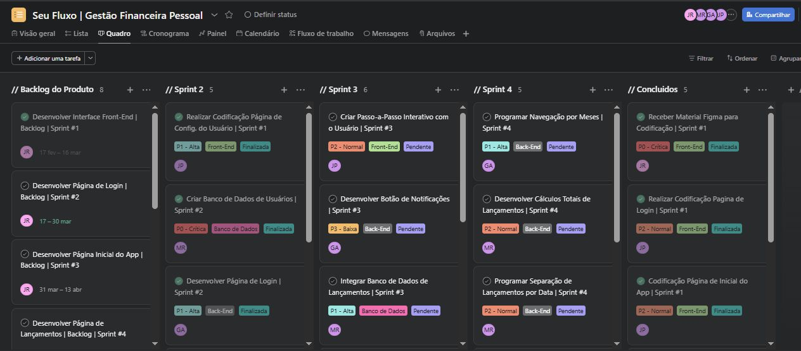

# Projeto Ágil - App Financeiro SeuFluxo

## 📌 Introdução

Este repositório documenta a aplicação prática das metodologias ágeis Scrum e Kanban no planejamento e organização do desenvolvimento de um aplicativo mobile de gestão financeira pessoal fictício, denominado como "SeuFluxo".

O projeto foi estruturado como um benefício corporativo para colaboradores de uma instituição financeira, com foco em controle financeiro, organização de despesas e visualização de lançamentos.

  

---

## 🎯 Objetivo do Projeto

Planejar e desenvolver um aplicativo mobile para:

- Controle de gastos
- Organização de receitas e despesas
- Visualização de lançamentos por período
- Integração com ERP corporativo para autenticação

---

## 🧠 Metodologia Aplicada

- Scrum Framework
- Organização em Sprints
- Product Backlog estruturado
- Priorização por impacto (P0 a P3)
- Fluxo Kanban para acompanhamento
- Entregas incrementais

---

## 📚 Navegação da Documentação
Acompanhe como foi o desenvolvimento deste projeto através deste menu organizado por etapas.

1. [Visão Geral do Projeto](docs/01-visao-geral.md)
2. [Termo de Abertura do Projeto (TAP)](docs/02-tap.md)
3. [Product Backlog](docs/03-backlog.md)
4. [Sprints e Quadro Kanban](docs/04-sprints.md)
5. [Conclusão](docs/05-conclusao.md)
---

## 🚀 Conceitos Ágeis Demonstrados

- Planejamento incremental
- Refinamento de backlog
- Priorização baseada em valor
- Controle de fluxo de trabalho
- Transparência no progresso
- Organização por responsabilidade técnica (Front-End / Back-End / Banco de Dados)

---

## 📌 Ferramenta Utilizada

Asana – Gerenciamento de tarefas com estrutura em quadros Kanban.

---

## 👤 Autor

Jhonattan Romão