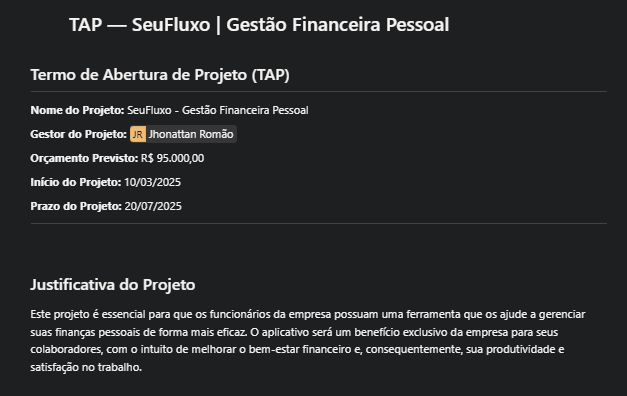
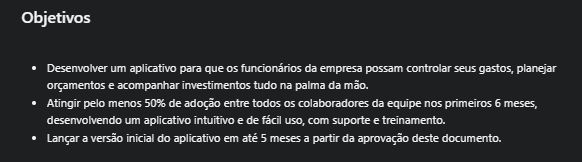
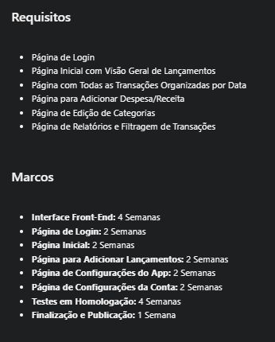
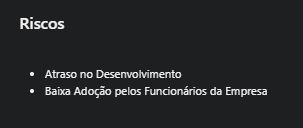

# 02 – Termo de Abertura do Projeto (TAP)

O TAP é um documento essencial que formaliza escopo, objetivos, cronograma, orçamento e riscos iniciais.

## Pontos Relevantes

- Orçamento estimado: R$ 95.000,00
- Prazo total: Março a Julho de 2025
- Identificação de riscos de atraso e baixa adoção
- Definição de marcos por funcionalidade

A criação do TAP garantiu alinhamento estratégico antes do início das Sprints.

➡️ Próxima etapa: [Product Backlog](03-backlog.md)