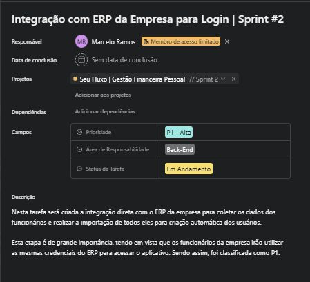
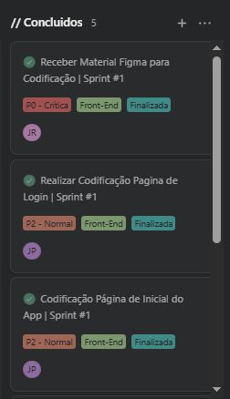

# 04 – Sprints e Quadro Kanban

O projeto foi elaborado com base no desenvolvimento por etapas, seguindo as metodologias ágeis Scrum.  

Cada Sprint representada em quadros distintos, possuem duração entre 1 e 4 semanas conforme definidas no TAP.

## Estrutura

Cada Card dentro de um quadro foi designado para uma tarefa específica, contendo informações importantes dela, como por exemplo um identificador “Sprint #x” para acompanhamento de qual sprint ela pertence.

## Fluxo Kanban

Devido às limitações da ferramenta, os quadros foram estruturados da seguinte forma:  
**Backlog → Sprint X → Sprint Y → Sprint Z → Concluídos**  

Nesse caso as Sprints X, Y e Z são variáveis e representam a Sprint atual, e suas duas próximas que virão em sequência, respectivamente.

Após finalização de uma tarefa (card) ela é etiquetada como “Finalizada” e em seguida é movida para o quadro de Concluídos.

➡️ Próxima Etapa: [Conclusão](05-conclusao.md)
⬅️ Etapa Anterior: [Product Backlog](03-backlog.md)
🏠 Voltar para o [README](../README.md)